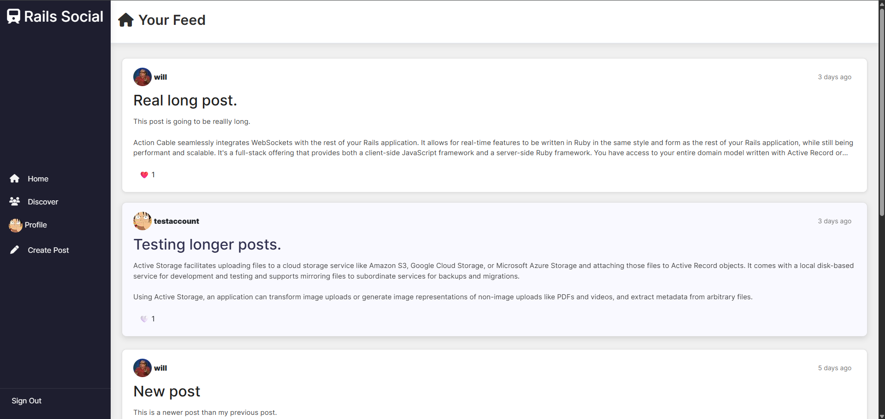
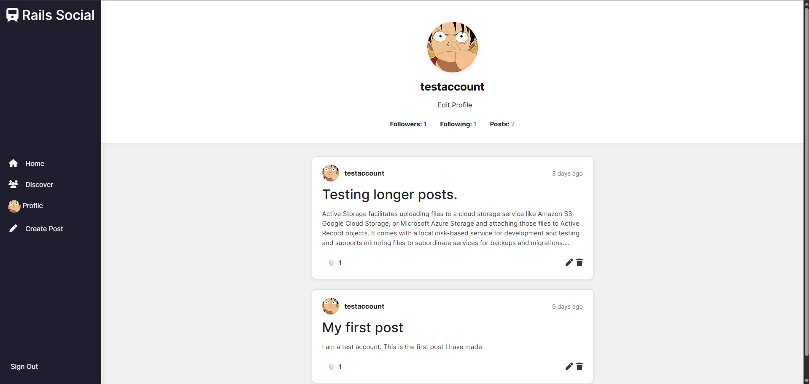
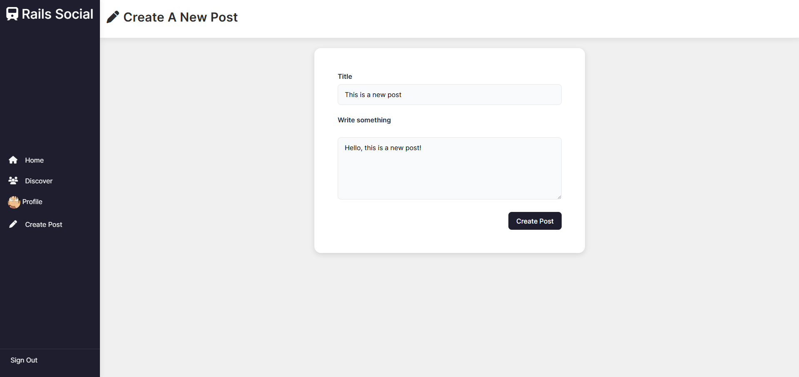
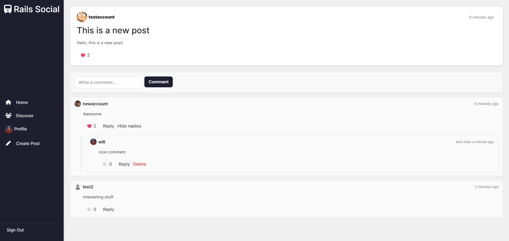
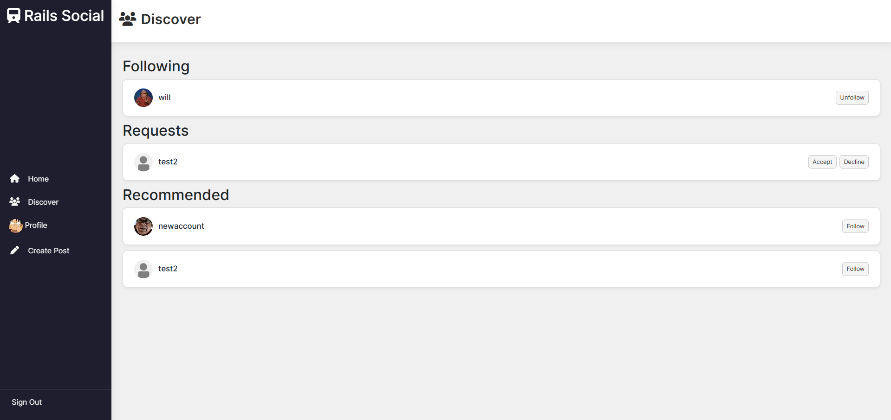
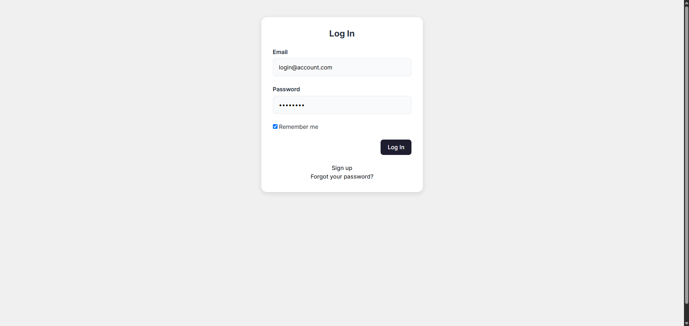
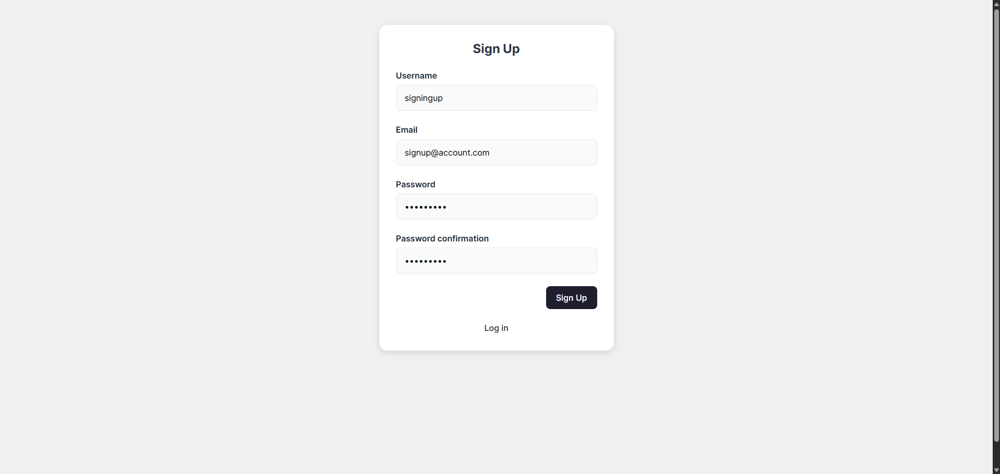

# Rails Social — A Full-Stack Social Media Web Application

[Click here](https://rails-social-app.onrender.com) to checkout the application deployed on Render! (currently down)

This is a full-stack social media web application built with **Ruby on Rails 8**, **Hotwire (Turbo + Stimulus)**, and **PostgreSQL**.  
It allows users to create posts, follow others, like and comment on content, and manage their profiles — all within a clean and responsive interface.

This project was built as part of the [Ruby on Rails curriculum](https://www.theodinproject.com/paths/full-stack-ruby-on-rails/courses/ruby-on-rails) from **The Odin Project**, and serves as a capstone to demonstrate what I’ve learned about Rails, full-stack development, and modern web design.

---

## Features

- **User authentication** using Devise (sign up, log in, edit profile)
- **User profiles** with avatar uploads via Active Storage
- **Posts** — create, edit, delete, and display user posts
- **Likes and comments** with live updates using Turbo Streams
- **Follow system** to connect users and view their posts
- **Clean, responsive UI** built with CSS
- **Instant feedback** through Hotwire (no full-page reloads)

---

## Tech Stack

- **Backend:** Ruby on Rails 8  
- **Frontend:** Hotwire (Turbo + Stimulus), CSS, HTML  
- **Database:** PostgreSQL  
- **Authentication:** Devise  
- **File Uploads:** Active Storage

---

## What I Learned

This project helped me bring together everything I’ve learned so far about full-stack web development in Rails. It also pushed me to explore areas where I had less experience (particularly in JavaScript) and adopt a learn-as-you-go mindset.

Some of the key takeaways include:

- Using **Hotwire and Turbo** to create dynamic, real-time features without a heavy JavaScript frameworks.

- Structuring a Rails app with **clear model relationships** and RESTful routes.

- Managing authentication, authorization, and profile editing with **Devise**.

- Designing a **consistent, user-friendly interface** with reusable CSS components.

---

## Future Improvements

There are several improvements and extensions I would like to work on next:

- A dark mode theme

- Photo uploads in posts

- More profile personalisation features (bio, social links, etc.)

- Chat rooms / direct messaging

- Smarter content organisation and recommendation algorithms

---

### Contact

Created by [**WillEdgington**](https://github.com/WillEdgington)

📧 **willedge037@gmail.com**

🔗 [**LinkedIn**](https://www.linkedin.com/in/williamedgington/)

---
## Screenshots

Here are a few screenshots from the application.

### Home Feed

### Profile Page

### Create Post

### Post and Comments

### Discover Page

### Log-in Page (Devise)

### Sign Up Page (Devise)

